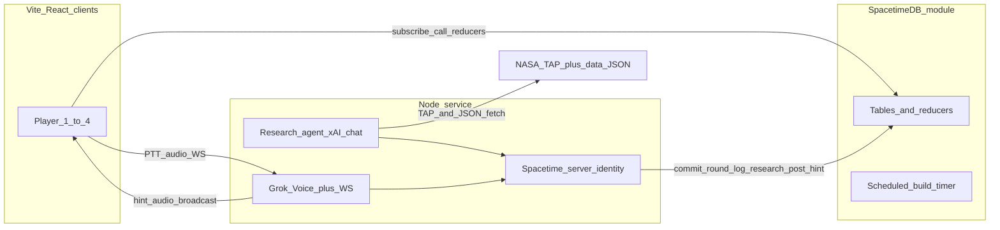

# Overburden — technical execution plan

Phased build from an empty repo: monorepo scaffold, SpacetimeDB as authoritative game state, React client for the full round loop, then Node service for research and voice. Each phase ends with a **checkpoint** you can verify before continuing.

**Game design:** [Plan.md](./Plan.md)

---

## Architecture (target)

**Recommended repo layout** (single npm/pnpm workspace):

| Path | Purpose |
|------|---------|
| `packages/shared` | Types, piece defs, eval/diagnosis pure functions (unit-testable) |
| `spacetimedb/` | Module: tables, reducers, scheduled timer, `commit_round` math |
| `client/` | Vite + React + Spacetime SDK |
| `server/` | Node TS: research agent, voice WS, Spacetime server token |
| `data/` | `game_constants.json`, `solar_system.json`, `cached_pack/` |
| `scripts/` | Fact-sheet scrape (one-time), dev orchestration |

Shared eval logic should live in `packages/shared` and be **imported by the Spacetime module** (or duplicated minimally only if the SDK forbids sharing — verify when scaffolding; prefer one implementation).

---

## Phase 0 — Monorepo scaffold

**Goal:** One command starts local Spacetime + client; empty server compiles.

- Initialize workspace (`pnpm` or `npm` workspaces).
- `spacetime` CLI: local module project in `spacetimedb/`, publish name documented in README.
- `client/`: Vite + React + TS, env `VITE_SPACETIME_URI`.
- `server/`: TS + `tsx watch`, env `XAI_API_KEY` (optional), `SPACETIME_*` for server identity.
- Root `package.json` scripts: `dev` (concurrently: spacetime dev, client, server stub).
- `.env.example` for both apps; no secrets in git.

### Checkpoint 0

- [ ] `pnpm dev` (or equivalent) starts without errors.
- [ ] Client shows a placeholder; Spacetime module deploys locally.
- [ ] `packages/shared` exports a trivial type consumed by client and module.

---

## Phase 1 — Spacetime: room, identity, phases

**Goal:** Multiplayer lobby without game rules yet.

Implement tables and reducers from [Plan.md](./Plan.md) (subset first):

- `room` (join code, host member id, phase: `lobby | briefing | build | debrief`, current `round_id`)
- `member` (room, display name, joined_at, online, is_host)
- `round` (minimal: planet display name placeholder, `mass_budget`, `build_ends_at` nullable)
- Reducers: `create_room`, `join_room` (max 4), `client_connected` / `client_disconnected`
- Host migration: on host disconnect, promote longest-joined **online** member.

Defer: `tile`, `piece`, research tables until Phase 3–4.

### Checkpoint 1 (acceptance #1 partially)

- [ ] Two browser tabs: create room, second joins with 4-letter code.
- [ ] Both see same member list; host badge updates if host tab closes.

---

## Phase 2 — Shared game math + static data

**Goal:** Testable core before wiring UI.

In `packages/shared`:

- Piece catalog (8 types + habitat rules) per Plan.md.
- `game_constants.json` loader types; BVAD rates for debrief copy only at first.
- **Pure functions:** `computeLoad`, `computePowerWaterO2Radiation`, `computeDiagnosis`, `computeNightBand`, twist flags from normalized profile.
- **Winnability:** brute-force counts per plan (~90k combos) + simple grid feasibility (ice count, lit tiles for solar, berm adjacency count ≤ 8).

In `data/`:

- Stub `game_constants.json` (CU costs, thresholds 12/12, mission length).
- Minimal `solar_system.json` for **one** body (Moon) to unblock Phase 3.

### Checkpoint 2

- [ ] Unit tests (vitest in `packages/shared`) for Moon vs Mars-style profiles: different cheapest build / band.
- [ ] Winnability returns budget in 14–24 CU or `reject`.

---

## Phase 3 — `commit_round` without LLM (fixture path)

**Goal:** Full round **data** on server before agent exists.

Spacetime tables: `planet_parameter`, `requirement`, `tile`, `research_log`.

Reducer `commit_round` (server identity only — initially callable from a **dev reducer** or CLI script until Node identity exists):

1. Accept committed parameter rows (or ingest from a JSON fixture).
2. Derive thresholds (night band, thermal load, berm count, ice tiles, dust flag).
3. Generate 8×8 `tile` rows (12 shaded, 4 ice if applicable).
4. Run winnability → set `round.mass_budget`.
5. Write `requirement` rows + headline fields on `round`.
6. Set phase → `briefing`; enable host `begin_build`.

Player reducers: `start_round` (host, lobby only), `begin_build` (starts 150s timer via `build_ends_at` + schedule).

**Node stub:** HTTP `POST /dev/commit-fixture?room=&body=moon` that calls real `commit_round` with server token.

### Checkpoint 3 (acceptance #2, #4 partial)

- [ ] After fixture commit, all subscribers see Mission Requirements Card data in DB.
- [ ] Impossible fixture rejected; valid fixture gets budget.

---

## Phase 4 — Client: lobby, briefing, phase routing

**Goal:** UI driven only by subscriptions.

Screens:

- **Home:** create / join.
- **Lobby:** research log (empty or “using fixture”), members, host **Start** when `round` committed.
- **Briefing:** planet card, requirements list (no pass/fail), **Begin build** (host).
- Route on `room.phase`.

Spacetime hook: single `useColony(roomId)` subscription SQL for room, members, round, parameters, requirements, tiles.

### Checkpoint 4

- [ ] Full path: create → join → fixture commit → briefing visible on both clients → host begins build (timer may not tick yet).

---

## Phase 5 — Build phase: grid, placement, cursors

**Goal:** Authoritative placement.

- `piece` table; habitat seeded in `commit_round` at center 2×2.
- Reducers: `place_piece`, `remove_piece` (refund CU), `move_cursor` (throttle client ~15/s).
- Validation: phase `build`, mass budget, tile rules (lit/ice/adjacent berm), piece-specific rules.
- React **CSS grid** 8×8: tile classes, piece icons, hover stats using round parameters (insolation, etc.).

### Checkpoint 5 (acceptance #1 complete)

- [ ] Four tabs (or two + simulation): place/remove syncs; cursors visible; invalid place shows server error.

---

## Phase 6 — Diagnosis, timer, evaluate, debrief

**Goal:** Complete game loop without AI.

- On `place_piece` / `remove_piece`: recompute diagnosis → `diagnosis` table (worst failing requirement + fact ref).
- Scheduled reducer: every second (or on `build_ends_at`), when time expired → `evaluate` → `result` rows → phase `debrief`.
- `lock_build` (host early end).
- Debrief UI: per-requirement pass/fail, kg copy, estimated fields, sources.
- `rematch`: new `round_id`, clear pieces, phase `lobby`; **defer** prefetch to Phase 9.

### Checkpoint 6 (acceptance #5 partial, #8)

- [ ] Diagnosis row updates on placement (verify in Spacetime dashboard or hidden dev panel).
- [ ] Timer hits 0; debrief matches hand-calculated formula for a known layout.
- [ ] Refresh rejoins same member (`localStorage` token).

---

## Phase 7 — Node service: Spacetime identity + research plumbing

**Goal:** Server can write research rows legally.

- Register **server identity** with Spacetime; store token in server env.
- Implement fetch cache + tool handlers **in process** (no LLM yet):
  - `fetch_solar_system_body` → read `data/solar_system.json`
  - `fetch_exoplanet` → TAP ADQL (can mock first)
  - `set_parameter` / `mark_estimated` / `log_step` → buffer until commit
- Call `commit_round` + `log_research` reducers from Node.
- Wire `create_room` on client → server watches new room → kicks **scripted** research (hardcoded tool sequence for Moon) replacing dev fixture.

### Checkpoint 7 (acceptance #3 partial)

- [ ] Create room triggers research log stream on clients.
- [ ] Moon scripted path commits; Mars scripted path yields different twist/thresholds.

---

## Phase 8 — Research agent (xAI chat + tools)

**Goal:** Live agent with provenance rules.

- xAI chat with tool definitions mirroring Plan.md research tools table.
- Enforce `fetch_id` in Node before any commit payload hits Spacetime.
- Twist selection + `write_card` validation (because-lines reference parameter fields).
- 20s timeout → `data/cached_pack/*.json`.
- **Debrief prefetch:** start next planet research when phase = `debrief`.

Populate `data/solar_system.json` (6 bodies) via script + manual mission fields; build **cached_pack** (~10 planets) for fallback.

### Checkpoint 8 (acceptance #2, #3, #9)

- [ ] Live exoplanet round (or cache) commits within budget.
- [ ] `set_parameter` without `fetch_id` rejected at Node layer.
- [ ] Rematch uses prefetched round when ready.

---

## Phase 9 — Voice: captions first, then Grok

**Goal:** Same hint on all devices; game playable without xAI.

**9a — Hint pipeline (no voice)**

- Table `hint`; reducer `post_hint` (server).
- Node watches timer → at 1:30 / 0:45 / 0:15 emits **template** hints from `diagnosis`.
- Client: caption bar; `speechSynthesis` optional per Plan.md fallback.
- Spacetime: `claim_floor` / `release_floor` + `voice_floor` (UI only until audio).

**9b — WebSocket audio**

- Room-scoped WS on server; PTT sends mic from one client; broadcast audio bytes (or use Grok’s output stream).
- Mute local; captions always on.

**9c — Grok Voice**

- One session per room on Node; tools read Spacetime via server subscription or poll.
- Ephemeral credentials if required by xAI; never expose `XAI_API_KEY` to browser.

### Checkpoint 9 (acceptance #5, #6)

- [ ] Proactive hint at 1:30 shows same caption on 4 clients.
- [ ] Mute silences audio on one device only.
- [ ] With key: spoken hint references diagnosis + planet fact; without key: template hints still fire.

---

## Phase 10 — Hardening + demo

- Host migration during build (acceptance #7).
- Room TTL 5 min after last member leaves.
- Berm hold-to-place (client UX + server confirm after hold duration).
- Polish: planet CSS backgrounds, piece tooltips.
- Write demo script in Plan.md; rehearse ~3.5 min round.

### Checkpoint 10 (full acceptance list)

Run all 9 checks in [Plan.md](./Plan.md) (Acceptance checks section).

---

## Suggested build order vs hackathon priority

If time is short, stop after a checkpoint and still have a demo:

| Minimum demo | Stop after |
|--------------|------------|
| “Multiplayer base builder” | Checkpoint 5 |
| “Real planet card + win/lose” | Checkpoint 6 + fixture Moon |
| “Space data + AI story” | Checkpoint 8 |
| Full pitch | Checkpoint 9b or 9c |

**Do not start** Grok Voice before diagnosis + timer work (Phase 6); voice is worthless without `diagnosis` rows.

---

## Risks to decide during Phase 0

- Spacetime TS module **importing** shared npm package — confirm SDK bundling; if blocked, keep eval in `packages/shared` and call from reducers via copied build step.
- Scheduled reducer granularity for 2:30 timer — use `build_ends_at` timestamp compare each tick.
- Deploy: hackathon likely **local Spacetime + tunneled client**; document production host later.

---

## What to run at each checkpoint

| CP | Command / action |
|----|------------------|
| 0 | `pnpm dev` |
| 1–6 | 2–4 browser windows, same LAN or localhost |
| 7–8 | Server logs + `research_log` table |
| 9 | 4 devices or tabs + mute test |
| 10 | Checklist in Plan.md |

---

## Implementation checklist (summary)

| Phase | Focus |
|-------|--------|
| 0 | Monorepo scaffold |
| 1 | Room / join / host migration |
| 2 | Shared eval + vitest + data stubs |
| 3 | `commit_round` fixture path |
| 4–5 | Client phases + grid placement |
| 6 | Diagnosis, timer, debrief |
| 7–8 | Node research + xAI agent |
| 9 | Hints, voice, Grok |
| 10 | Polish + acceptance tests |
