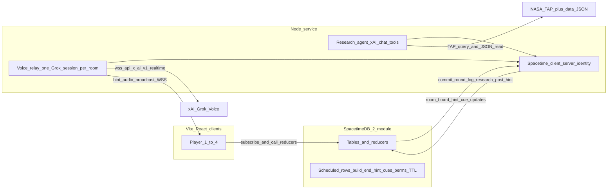

# Overburden — technical execution plan

Phased build from an empty repo: monorepo scaffold, SpacetimeDB as authoritative game state, React client for the full round loop, then Node service for research and voice. Each phase ends with a **checkpoint** you can verify before continuing.

**Game design:** [Plan.md](./Plan.md)

---

## Architecture (target)

**Recommended repo layout** (single pnpm workspace):

| Path | Purpose |
|------|---------|
| `packages/shared` | Types, piece defs, threshold derivation, eval, winnability, **board read** (diagnosis + suggestion) — pure functions (unit-testable) |
| `spacetimedb/` | SpacetimeDB 2.x TypeScript module: tables, reducers, views, scheduled rows |
| `client/` | Vite + React + Spacetime TS SDK (generated bindings) |
| `server/` | Node TS: research agent, voice relay WS, Spacetime client with server identity |
| `data/` | `solar_system.json`, `cached_pack/` (Phase 8). Game constants live in `packages/shared/src/pieces.ts` so the module bundles them |
| `scripts/` | Fact-sheet scrape (one-time), cached-pack builder (offline tier 3), dev orchestration |

Shared eval logic lives in `packages/shared` and is **imported by the Spacetime module**, the client (hover stats), and the server (template hints). Verify in Phase 0 that the module bundler resolves the workspace package; if not, copy the built file into `spacetimedb/src/shared/` via a prebuild script — still one source of truth.

---

## Platform requirements

### SpacetimeDB (2.x, TypeScript module)

| Requirement | How |
| --- | --- |
| **Module API** | `table`, `schema`, `t` from `spacetimedb/server`; reducers/lifecycle hooks must be **`export const`** (bare calls are silently ignored). `ScheduleAt` imports from `spacetimedb`. Throw `SenderError` for rejected player actions. |
| **Public vs private** | Player-visible tables `public: true`. `server_config` is private. There is **no diagnosis table** — Node computes the board read at cue time from public tables, so pass/fail is never stored where the client UI reads it. |
| **Server identity** | `init` stores the publisher identity in `server_config.owner`. Server-only reducers accept the **owner or** a registered `server_config.server` (`set_server_identity`, owner only). In dev the Node service uses the local CLI login (`spacetime login show --token`) — the publisher — so no registration step; in production set `SPACETIME_TOKEN`. |
| **Enums** | Declare variants in **PascalCase** (`'Lobby'`): generated client bindings use the canonical PascalCase tag, so module and client then compare identical strings. |
| **Bindings** | `spacetime.json` generates two targets: `client/src/module_bindings` and `server/src/module_bindings`. |
| **Timers** | **Scheduled tables, not polling.** One-shot `ScheduleAt` rows for: build end (`build_ends_at`), hint cues (8 per round — see Plan.md cue schedule), berm completion, room TTL. Scheduled reducers run as the module identity; clients calling them get "No such procedure" (verified) — keep a `ctx.sender.equals(ctx.databaseIdentity)` guard anyway. Scheduled table option: `scheduled: (): any => reducerName`. |
| **Countdown** | Clients render the countdown locally from `round.build_ends_at`; the server is authoritative only at the scheduled end. |
| **Determinism** | Use **`ctx.random`** (verified: `ctx.random()`, `ctx.random.integerInRange(a, b)`) for tile layout — stdlib RNG/clocks are unavailable in modules. |
| **Procedures** (HTTP from module) | Available but **not used** — all external fetches stay in Node, where the LLM loop and fetch cache live. |
| **Client** | Bindings regenerate automatically via `spacetime dev` (`generate` target in `spacetime.json`). Auth token in **`sessionStorage`** (refresh = same member; each tab = its own player for local testing). React: `SpacetimeDBProvider`, `useTable`, `useReducer` from `spacetimedb/react`; reducer promises reject with the `SenderError` message (verified). |
| **Node** | Same TS SDK in Node with a persisted server token (`SPACETIME_TOKEN`). Subscribes to `room`, `round`, `planet_parameter`, `requirement`, `tile`, `piece`, `hint_cue` — everything needed to compute the board read locally. |
| **Hosting** | Dev: `spacetime dev` locally. Demo: **Maincloud** (no tunnel needed for 4 devices). |

### Grok Voice (xAI realtime)

| Requirement | How |
| --- | --- |
| **Endpoint** | `wss://api.x.ai/v1/realtime?model=grok-voice-latest` (resolves to `grok-voice-think-fast-*`; pin the versioned name for the demo). Needs a regular **API key** from console.x.ai → API Keys (management keys are rejected). |
| **Auth** | Session runs **in Node**, so use `Authorization: Bearer $XAI_API_KEY`. **No ephemeral tokens** — browsers never talk to xAI. |
| **Mode** | **Text in, audio out.** No microphone input; players never talk to it. |
| **Audio format** | Output `audio/pcm` 24 kHz, 16-bit little-endian, `audio.output.transport = "binary"` so Node relays raw frames without base64. |
| **Turn detection** | `turn_detection: { type: null }` — no audio input, so turns are driven only by our `response.create` calls. |
| **Cues** | On a `hint_cue` row: Node computes the board read, then `conversation.item.create` with one text item — **fact mode:** the fun fact text; **hint mode:** diagnosis, suggestion (piece + tile), board summary, change since last cue, time left. Then `response.create` with **per-response `instructions`** for the mode (fun fact / nudge / direction / exact). |
| **Session instructions** | Persona (calm Mission Control), ≤ 2 sentences, use grid coordinates as given, never invent numbers or tiles, never mention pieces not in the suggestion during exact hints. |
| **Tools** | **None.** All context is in the text item, so there are no tool-call round trips. Do not enable `web_search` / `x_search`. |
| **Output** | Binary transport verified: raw PCM arrives as WebSocket binary frames → broadcast to every client. Captions: `response.output_audio_transcript.delta` (live) and `response.output_audio_transcript.done` (`transcript` field) → `post_hint`. End of line: `response.output_audio.done` / `response.done`. |
| **Latency** | Measured with `reasoning.effort: "none"`: hint **~750 ms to first audio**, ~2.3 s to done (7 s of speech); `force_message` ~460 ms. Send the cue ~1 s early. |
| **Lifecycle** | Open the session at `begin_build`, close at debrief — no idle billing. One session per room. |
| **Fallbacks** | Key present but model call fails → speak the template line verbatim with `force_message` (Grok voice, no model). No key → template line to `hint` table; clients speak it with `speechSynthesis`. Templates: fun facts verbatim; hints like "{Requirement} is short — {fact}. Try {piece} on {tile}." |
| **Pronunciation** | `replace` map for planet names (e.g. "TRAPPIST-1 e"). |

### Browser / network

| Requirement | How |
| --- | --- |
| **Reachability** | All devices must reach the Node WS. If the client is served over HTTPS (Vercel/Netlify), Node must be `wss://` (e.g. `cloudflared` tunnel) to avoid mixed-content blocking. Same-LAN HTTP also works since there's no mic. |
| **Autoplay** | Audio must be unlocked by a user gesture — create the `AudioContext` on the Join/Create click. |
| **Playback** | `AudioWorklet` ring buffer per client; small jitter buffer (~100 ms). Local mute = gain 0; captions always on. |

---

## Phase 0 — Monorepo scaffold

**Goal:** One command starts local Spacetime + client + server stub.

- pnpm workspace: `packages/shared`, `spacetimedb`, `client`, `server`.
- `spacetime init --lang typescript` into `spacetimedb/`; module name in README.
- `client/`: Vite + React + TS; env `VITE_SPACETIME_URI`, `VITE_SPACETIME_DB`, `VITE_VOICE_WS_URL`.
- `server/`: TS + `tsx watch`; env `XAI_API_KEY` (optional), `SPACETIME_URI`, `SPACETIME_DB`, `SPACETIME_TOKEN`.
- Root `pnpm dev` (concurrently: `spacetime dev`, client, server). `.env.example` files; no secrets in git.
- Spike notes (verified on SpacetimeDB 2.10.2): add `typescript` as a devDependency **inside** `spacetimedb/` (otherwise `spacetime build` skips typechecking); `spacetime.local.json` overrides the database name, so run ad-hoc `spacetime sql/call` from outside the project dir or rely on it deliberately; module must `export default spacetimedb`, and only registered things may be exported.
- Exoplanet Archive `*_reflink` values are HTML anchors (`<a href=…>Agol et al. 2021</a>`) — parse into `source_label` + `source_url`. Filtered pool = 65 planets (verified).

### Checkpoint 0

- [ ] `pnpm dev` starts without errors.
- [ ] Client shows a placeholder; module publishes locally; bindings generate.
- [ ] `packages/shared` exports a function used by client **and** module (proves the import path).

---

## Phase 1 — Spacetime: room, identity, phases

**Goal:** Multiplayer lobby without game rules yet.

- `server_config` (private): `owner`, `server`; `init` stores owner; `set_server_identity` (owner only).
- `room` (join code, host member, phase `lobby | briefing | build | debrief`, `current_round_id`, `next_round_id`)
- `member` (identity PK — one room per identity, room, display name, `joined_at`, `online`); host is `room.host` (single source of truth)
- `session` (private): one row per connection; `online` = identity has any session (handles multiple tabs / reconnect races)
- `round` (`status: researching | ready | active | done`, planet name, `mass_budget`, `build_ends_at?`)
- Reducers: `create_room`, `join_room` (max 4, 4-letter code), lifecycle `clientConnected` / `clientDisconnected` (mark online/offline).
- Host migration: on host disconnect, promote longest-joined **online** member.

### Checkpoint 1 (acceptance #1 partial)

- [x] Two tabs: create room, second joins with code.
- [x] Same member list on both; host badge moves when the host tab closes; refresh rejoins as the same member.
- [x] `pnpm check:phase1` (5 simulated players: create, join, bad code, blank name, full room, host disconnect → migration, reconnect keeps seat, host leaves, empty room deleted).

---

## Phase 2 — Shared game math + static data

**Goal:** Testable core before wiring UI.

In `packages/shared`:

- Piece catalog (8 types + habitat 2×2) per Plan.md.
- **Threshold derivation** from a profile: night band, thermal load, ice/CO₂ flags, triggered twists, berm count.
- **Eval:** `computeLoad`, `evaluate(board, profile, requirements)` → per-requirement pass/fail + reason.
- **Board read:** `boardRead(board, profile, requirements, budget, prevRead?)` →
  - diagnosis (per-requirement status, worst failing, shortfall, responsible parameter field)
  - suggestion: from the winnability enumeration, the winning count-vector with the **fewest adds/removes** from the current board (tie → least mass), mapped to tiles (first valid free tile nearest the habitat, A–H × 1–8)
  - board summary text (pieces + coordinates, free ice/lit/adjacent tiles, mass left, pending berms)
  - change since last read (newly passing requirements, board unchanged?)
- **Winnability:** brute-force counts (~90k combos) + tile feasibility (ice tiles, lit tiles, ≤ 8 habitat-adjacent tiles) → cheapest CU → `budget = clamp(ceil(min × 1.25), 14, 24)` or `reject`.
- Seeded PRNG + tile generator (12 shaded, 4 ice; polar bodies put ice inside shade).

Constants (piece stats, 12/12, crew 4, 30 sols, BVAD kg) in `pieces.ts`; test fixtures for Moon / Mars / Titan / bright exoplanet in `fixtures.ts` (approximate values — sourced profiles come in Phase 8).

Implementation notes: suggestions fill the habitat-adjacent ring last so berms always have room; batteries count only if at least one solar array exists; measured cost — solve ~35 ms, board read < 1 ms.

### Checkpoint 2

- [x] Vitest: Moon, Mars, Titan, bright-exoplanet fixtures reproduce the Plan.md balance table (cheapest build + CU + budget 20 / 19 / 23 / 22).
- [x] Winnability returns a budget in 14–24 or `reject` (grid can't fit / over 24 CU).
- [x] Following the board-read suggestion from an empty board wins on all four fixtures; over-budget boards get a remove suggestion.

---

## Phase 3 — `commit_round` without LLM (fixture path)

**Goal:** Full round **data** on the server before the agent exists.

Tables: `planet_parameter`, `requirement`, `tile`, `research_log`.

`commit_round(room_id, parameters[], twist, card_text)` — **server identity only**:

1. Validate every parameter has `sourced` + source, or `estimated` + note.
2. Validate the chosen twist is one the parameters trigger.
3. **Compute thresholds** with `packages/shared` (agent never sends numbers for thresholds).
4. Generate tiles (seeded), seed habitat piece, run winnability → `mass_budget`, or reject.
5. Write `requirement` rows (threshold + `derived_from` + because-text) and headline / scale text / 3 `fun_facts` on `round`.
6. Set `round.status = ready` and `room.next_round_id`. **Does not change room phase** (so prefetch during debrief is safe).

Player reducers: `start_round` (host; lobby → briefing using `next_round_id`), `begin_build` (host; briefing → build, sets `build_ends_at = now + 150s`, inserts scheduled build-end and hint-cue rows).

Dev path: `log_research`/`commit_round` callable via `spacetime call` with the owner identity, or a Node `POST /dev/commit-fixture?room=&body=moon`.

### Checkpoint 3 (acceptance #2, #4 partial)

- [x] After fixture commit, all subscribers see the requirement card rows.
- [x] Invalid research rejected (untriggered twist, missing source, unknown citation field, wrong fun-fact count); valid fixture gets a budget; players can't call `commit_round`.
- [x] `pnpm check:phase3` (9 checks; `--wait-end` also waits out the scheduled build end).

Note: with the current constants every *legitimate* profile is winnable (one reactor + tanks always fits under 24 CU), so the winnability rejection path is covered by unit tests with synthetic rules.

Round rules (solar per array, night band, thermal load, CO₂, ice, berms) are stored as columns on `round`, derived server-side; the Node service reconnects automatically (startup race with `spacetime dev`, breaking republishes).

---

## Phase 4 — Client: lobby, briefing, phase routing

**Goal:** UI driven only by subscriptions.

- **Home:** create / join (this click also unlocks audio).
- **Lobby:** members, live `research_log`, host **Start** enabled when a round is `ready`.
- **Briefing:** planet card, Mission Requirements Card (threshold + because-line + source tag, no pass/fail), host **Begin build**.
- Route on `room.phase`. One subscription set scoped to the room: room, members, round, parameters, requirements, tiles, pieces, cursors, hints, result.

### Checkpoint 4

- [ ] Create → join → fixture commit → briefing on both clients → host begins build; countdown renders from `build_ends_at`.

---

## Phase 5 — Build phase: grid, placement, cursors, berms

**Goal:** Authoritative placement, including the mass-vs-time berm mechanic.

- `piece` table; `cursor` table (one row per member).
- Reducers: `place_piece`, `remove_piece` (refund), `move_cursor` (client throttles ~15/s).
- Validation: phase `build`, budget, tile rules (lit / ice / habitat-adjacent), occupancy.
- **Berms (server-timed):** `start_berm(tile)` inserts a `pending` berm + scheduled completion at `now + hold(g)`; `cancel_berm` on release deletes it. The scheduled reducer finalizes it. Client shows a progress ring.
- React **CSS grid** 8×8: tile classes, piece icons, hover stats from `packages/shared` + round parameters.

### Checkpoint 5 (acceptance #1 complete)

- [ ] Four tabs: place/remove syncs; cursors visible; invalid placement shows the `SenderError` message; releasing a berm early cancels it.

---

## Phase 6 — Timer, evaluate, debrief

**Goal:** Complete game loop without AI.

- Scheduled build-end reducer (or host `lock_build`, which deletes the schedule row) → `evaluate` → `result` rows → phase `debrief`.
- Debrief UI: per-requirement pass/fail linked to its research line, kg figures, scale card, estimated fields, sources.
- `rematch`: new round from `next_round_id` if `ready` (→ briefing), else → lobby until research commits. Clear pieces/cursors.
- Room TTL: on last member offline, schedule deletion 5 min later; cancel if someone returns.

### Checkpoint 6 (acceptance #8, #9)

- [ ] Dev panel (dev builds only) shows `boardRead` for the current grid; suggestion actually completes the base when followed.
- [ ] Timer hits 0; debrief matches the hand-calculated formula for a known layout.

---

## Phase 7 — Node service: Spacetime identity + research plumbing

**Goal:** Server can write research rows legally.

- Generate the server identity on first run, persist `SPACETIME_TOKEN`, register it with `set_server_identity`.
- Fetch cache + tool handlers **in process** (no LLM yet):
  - `list_candidates`, `fetch_solar_system_body` (JSON), `fetch_exoplanet` (TAP ADQL against `pscomppars`, JSON output; mock first)
  - `set_parameter(fetch_id, field)` / `mark_estimated` → buffered; `log_step` → `log_research` immediately
- Node subscribes to `room`; a room with no `ready` round (or in debrief with no `next_round_id`) triggers research.
- **Scripted** research (hardcoded tool sequence for Moon / Mars) replaces the dev fixture.

### Checkpoint 7 (acceptance #3 partial)

- [ ] Creating a room streams research log lines to clients.
- [ ] Moon and Mars scripted paths commit with different twists/thresholds.
- [ ] `set_parameter` with an unknown `fetch_id` is rejected.

---

## Phase 8 — Research agent (xAI chat + tools)

**Goal:** Live agent under the provenance rules.

- xAI chat completions (OpenAI-compatible API at `https://api.x.ai/v1`) with function tools from the Plan.md tools table. Model via `XAI_RESEARCH_MODEL`.
- Tool loop in Node; enforce `fetch_id` + "because-lines reference parameter rows" before calling `commit_round`.
- 20 s timeout or 2 rejected commits → load a planet from `data/cached_pack/`.
- **Debrief prefetch:** research the next planet as soon as phase = `debrief`.
- `scripts/build-cached-pack`: offline run with xAI's server-side `web_search` tool restricted to the allowlist (limits on domains per tool — split into multiple passes if needed); write quotes + URLs for manual review.
- Fill `data/solar_system.json` (6 bodies) via the scrape script + hand-entered mission fields.

### Checkpoint 8 (acceptance #2, #3, #9)

- [ ] A live exoplanet round (or cache fallback) commits within 20 s.
- [ ] Two consecutive rounds produce different requirement cards.
- [ ] Rematch uses the prefetched round instantly.

---

## Phase 9 — Voice: captions first, then Grok

**Goal:** Same hint on all devices; game fully playable without xAI.

**9a — Hint pipeline (no voice)**

- `hint` table + `post_hint` (server only). `begin_build` inserts 8 `hint_cue` scheduled rows (2:25 / 2:05 / 1:45 fun facts; 1:30 nudge; 1:10, 0:50 direction; 0:30, 0:15 exact). Node fires each ~2 s early to absorb speech latency.
- Node on cue: compute `boardRead` → apply no-repeat/escalate and acknowledge-progress rules → template line → `post_hint`. Skip the cue if the previous line is still playing.
- Fun facts come from `round.fun_facts` (written by the research agent / fixture).
- Client: caption bar; `speechSynthesis` reads new hints; mute toggle.

**9b — Audio broadcast (no Grok yet)**

- Room-scoped WS endpoint on Node (receive-only for clients); client joins with room id + Spacetime identity.
- Test by broadcasting a canned 24 kHz PCM clip on each cue (verifies relay, playback, sync, mute).

**9c — Grok Voice**

- One session per room in Node (opened at `begin_build`, closed at debrief), configured per the **Grok Voice** requirements table.
- Cues → text item (fun fact, or board read + time + mode) → `response.create` with mode instructions.
- Output audio frames → broadcast; transcript → `post_hint` (captions). Speech replaces `speechSynthesis` when Grok is active.

### Checkpoint 9 (acceptance #5, #6)

- [ ] Opening fun facts play at 2:25 / 2:05 / 1:45; same caption and audio on 4 devices.
- [ ] Mute silences audio on one device only; captions remain.
- [ ] Hints track the grid: placing the suggested piece changes the next hint (acknowledges progress, moves to the next gap); an unchanged board escalates.
- [ ] At 0:30 the hint names a specific piece + valid tile. Without key: template lines still fire.

---

## Phase 10 — Hardening + demo

- Host migration during build (acceptance #7); Node voice session unaffected.
- Node restart mid-round: re-subscribe, reopen the Grok session if phase = `build`.
- Deploy rehearsal on 4 real devices (client host + Node reachable over `wss` + Maincloud).
- Polish: planet CSS backgrounds, piece tooltips, research log animation.
- Write the demo script in Plan.md; rehearse a ~3.5 min round.

### Checkpoint 10

Run all 9 acceptance checks in [Plan.md](./Plan.md).

---

## Suggested build order vs hackathon priority

If time is short, stop after a checkpoint and still have a demo:

| Minimum demo | Stop after |
|--------------|------------|
| "Multiplayer base builder" | Checkpoint 5 |
| "Real planet card + win/lose" | Checkpoint 6 + fixture Moon |
| "Space data + AI story" | Checkpoint 8 |
| Full pitch | Checkpoint 9c (9a + `speechSynthesis` is a usable fallback) |

**Do not start** Grok Voice before `boardRead` works (Phase 2) and the loop runs (Phase 6) — voice is useless without it.

---

## Risks to resolve early

| Risk | When | Mitigation |
| --- | --- | --- |
| ~~Module bundler can't import `packages/shared`~~ | Verified OK (npm workspace import bundles) | — |
| Suggestion feels like the game playing itself | Playtest | Exact hints only from 0:30; earlier hints stay at system/piece-type level |
| 4 devices playing slightly out of sync in one room | Phase 9b | ~100 ms jitter buffer; players can mute all but one device |
| Grok latency makes hints late | Phase 9c | `reasoning.effort: "none"`, send cue ~2 s early, `force_message` fallback |
| TAP query slow / down | Phase 8 | 20 s timeout → cached pack; prefetch during lobby and debrief |

---

## What to run at each checkpoint

| CP | Command / action |
|----|------------------|
| 0 | `pnpm dev` |
| 1–6 | 2–4 browser windows on localhost |
| 7–8 | Server logs + `research_log` table |
| 9 | 4 real devices + mute test |
| 10 | Acceptance checklist in Plan.md |

---

## Implementation checklist (summary)

| Phase | Focus |
|-------|--------|
| 0 | Monorepo scaffold |
| 1 | Room / join / identity / host migration |
| 2 | Shared math, winnability, tiles + vitest |
| 3 | `commit_round` fixture path |
| 4–5 | Client phases, grid, placement, berms |
| 6 | Timer, debrief, rematch, board-read dev panel |
| 7–8 | Node research plumbing + xAI agent |
| 9 | Hints → audio broadcast → Grok Voice |
| 10 | Hardening, deploy, demo |
